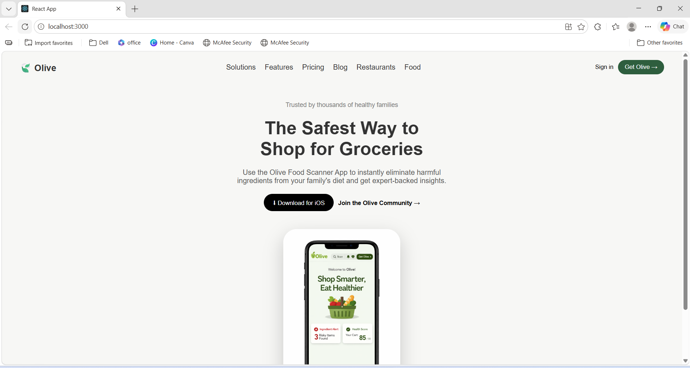

# 🫒 Olive Landing Page Clone

## 📌 Project Overview

This project is a **frontend recreation of a landing page** based on a given design screenshot.
The goal was to replicate the UI as closely as possible using modern frontend technologies.

---

## 🎯 Task Description

As part of the assignment, I was given a **design reference (screenshot)** and asked to:

* Recreate the webpage layout
* Match the design visually (spacing, alignment, colors)
* Use any frontend framework of my choice
* Build a clean and responsive UI

---

## 🚀 Tech Stack Used

* **React.js** – for building UI components
* **CSS3** – for styling and layout
* **Flexbox** – for alignment and positioning

---

## 🧠 Key Features Implemented

* Responsive **Navigation Bar**
* Clean **Hero Section**
* Styled **Call-to-Action Buttons**
* Centered **Phone Mockup Display**
* Modern UI with shadows and spacing

---

## 🖼️ Project Screenshot

<p align="center">
  
</p>

---

## ⚙️ How to Run Locally

1. Clone the repository:

```bash
git clone https://github.com/your-username/olive-clone.git
```

2. Navigate to project folder:

```bash
cd olive-clone
```

3. Install dependencies:

```bash
npm install
```

4. Start the application:

```bash
npm start
```

---

## 📂 Project Structure

```
olive-clone/
 ├── public/
 ├── src/
 │    ├── App.js
 │    ├── App.css
 │    ├── index.js
 │    └── assets (images)
 ├── screenshot.png
 └── README.md
```

---

## 💡 Learnings

* Understanding of **React component structure**
* Handling **assets (images) in React**
* Building UI from a **design reference**
* Improving **CSS layout skills using Flexbox**

---

## 📌 Future Improvements

* Make the design fully **responsive for mobile devices**
* Add **animations and transitions**
* Improve **UI precision to match pixel-perfect design**

---

## 🔗 GitHub Repository

👉 https://github.com/LekhaVemani/olive-clone

---

## 🙌 Conclusion

This project helped me strengthen my frontend development skills by converting a static design into a functional UI using React.

---


## Project Screenshot


